# OpenClaw Voice Module — Architecture

The `voice/` module is a **plug-in layer** on top of OpenClaw. It provides speech-to-text, text-to-speech, audio recording, and audio playback through swappable provider interfaces. Agent Mode, Plan Mode, Ask Mode, `ToolLoopAgent`, Ollama integration, and tool-calling logic are **not modified** by this module.

---

## Design Principles

1. **Separation of concerns** — Voice I/O lives in `voice/`; agent reasoning stays in `modes/`.
2. **Interface-first** — All providers implement contracts defined in `voice/interfaces/`.
3. **Factory wiring** — `createVoiceStack()` selects providers from env config; no hard-coded dependencies in session logic.
4. **Callback integration** — `VoiceSession.conversationTurn()` accepts a text callback where existing orchestrators plug in.
5. **Provider swap = config change** — Migrating STT or TTS requires only a new provider class + env var, not agent changes.

---

## Folder Structure

```
voice/
├── ARCHITECTURE.md          ← This document
├── ROADMAP.md               ← Future provider integration plan
├── index.ts                 ← Public API barrel export
├── types.ts                 ← Shared types (AudioFormat, VoiceConfig, etc.)
├── config.ts                ← Env-based configuration loader
├── factory.ts               ← createVoiceStack() — wires all four abstractions
│
├── interfaces/              ← Provider contracts (swap point)
│   ├── speech-to-text.ts    ← ISTTProvider
│   ├── text-to-speech.ts    ← ITTSProvider
│   ├── audio-recorder.ts    ← IAudioRecorder
│   ├── audio-playback.ts    ← IAudioPlayback
│   └── index.ts
│
├── providers/               ← Concrete STT/TTS implementations
│   ├── stt/
│   │   ├── faster-whisper.ts   ← Initial STT (Python subprocess)
├── python/
│   ├── transcribe.py           ← Local Faster-Whisper script
│   └── requirements.txt
│   │   └── index.ts            ← createSTTProvider() factory
│   └── tts/
│       ├── elevenlabs.ts       ← Initial TTS provider
│       └── index.ts            ← createTTSProvider() factory
│
├── audio/                   ← Platform audio I/O (not cloud APIs)
│   ├── recorder/
│   │   └── node-recorder.ts    ← ffmpeg-based mic capture
│   └── playback/
│       └── node-player.ts      ← ffplay-based speaker output
│
└── session/
    └── voice-session.ts     ← Record → STT → callback → TTS → play
```

---

## Dependency Diagram

```mermaid
flowchart TB
    subgraph OpenClaw Core ["OpenClaw Core (unchanged)"]
        Agent[Agent Mode]
        Plan[Plan Mode]
        Ask[Ask Mode]
        TLA[ToolLoopAgent]
        Ollama[Ollama / ai.config.ts]
        Tools[Agent Tools]

        Agent --> TLA
        Plan --> TLA
        Ask --> TLA
        TLA --> Ollama
        TLA --> Tools
    end

    subgraph Voice Module ["voice/ (plug-in layer)"]
        VS[VoiceSession]
        Factory[createVoiceStack]

        subgraph Interfaces ["interfaces/"]
            ISTT[ISTTProvider]
            ITTS[ITTSProvider]
            IRec[IAudioRecorder]
            IPlay[IAudioPlayback]
        end

        subgraph STT Providers ["providers/stt/"]
            FW[FasterWhisperProvider]
            WC["Whisper.cpp (planned)"]
            OAI_STT["OpenAI STT (planned)"]
            DG["Deepgram (planned)"]
        end

        subgraph TTS Providers ["providers/tts/"]
            EL[ElevenLabsProvider]
            Piper["Piper (planned)"]
            OAI_TTS["OpenAI TTS (planned)"]
            Cart["Cartesia (planned)"]
            Azure["Azure Speech (planned)"]
        end

        subgraph Audio I/O ["audio/"]
            NR[NodeAudioRecorder]
            NP[NodeAudioPlayback]
        end

        Factory --> ISTT
        Factory --> ITTS
        Factory --> IRec
        Factory --> IPlay

        ISTT --> FW
        ITTS --> EL
        IRec --> NR
        IPlay --> NP

        VS --> ISTT
        VS --> ITTS
        VS --> IRec
        VS --> IPlay
    end

    subgraph Integration ["Future integration point"]
        VO["modes/voice/orchestrator.ts (future)"]
    end

    VO -->|"processText callback"| TLA
    VO --> VS
    Factory --> VS

    style OpenClaw Core fill:#1a1a2e,stroke:#5b4d9e,color:#e8dcf8
    style Voice Module fill:#0f3460,stroke:#e94560,color:#fff
    style Integration fill:#16213e,stroke:#0f3460,color:#fff
```



---

## Interface Contracts

### ISTTProvider — Speech-to-Text

```typescript
interface ISTTProvider {
  readonly id: string;
  readonly name: string;
  transcribe(audio: Uint8Array, options?: STTOptions): Promise<TranscriptionResult>;
  isAvailable(): Promise<boolean>;
}
```

**Initial:** `FasterWhisperProvider` — local Python subprocess (`voice/python/transcribe.py`), WAV → JSON stdout. No Docker or HTTP server.

### ITTSProvider — Text-to-Speech

```typescript
interface ITTSProvider {
  readonly id: string;
  readonly name: string;
  synthesize(text: string, options?: TTSOptions): Promise<SynthesisResult>;
  isAvailable(): Promise<boolean>;
}
```

**Default:** `PiperProvider` — local ONNX TTS. `ElevenLabsProvider` is optional (cloud).

### IAudioRecorder — Microphone Capture

```typescript
interface IAudioRecorder {
  readonly id: string;
  start(options?: RecordOptions): Promise<void>;
  stop(): Promise<RecordingResult>;
  isRecording(): boolean;
  listDevices?(): Promise<AudioDevice[]>;
}
```

**Initial:** `NodeAudioRecorder` — ffmpeg subprocess capture (cross-platform).

### IAudioPlayback — Speaker Output

```typescript
interface IAudioPlayback {
  readonly id: string;
  play(audio: Uint8Array, format: AudioFormat): Promise<void>;
  stop(): Promise<void>;
  isPlaying(): boolean;
}
```

**Initial:** `NodeAudioPlayback` — ffplay subprocess playback.

---

## Data Flow

```
┌──────────┐    record     ┌──────────────┐    transcribe    ┌─────────────┐
│ Microphone│ ──────────► │ IAudioRecorder│ ──────────────► │ ISTTProvider │
└──────────┘               └──────────────┘                  └──────┬──────┘
                                                                    │ text
                                                                    ▼
                                                          ┌─────────────────┐
                                                          │ processText()   │
                                                          │ (agent callback)│
                                                          └────────┬────────┘
                                                                   │ response text
                                                                   ▼
┌──────────┐    play        ┌──────────────┐    synthesize   ┌─────────────┐
│ Speakers  │ ◄─────────── │ IAudioPlayback│ ◄────────────── │ ITTSProvider │
└──────────┘               └──────────────┘                  └─────────────┘
```

`VoiceSession` orchestrates this pipeline. The `processText` callback is the **only touch point** with OpenClaw agent logic:

```typescript
import { createVoiceStack, createVoiceSession } from "./voice/index.ts";
import { ToolLoopAgent, stepCountIs } from "ai";
import { getAgentModel } from "./ai/index.tsx";

const stack = createVoiceStack();
const session = createVoiceSession(stack);

const agent = new ToolLoopAgent({
  model: getAgentModel(),
  stopWhen: stepCountIs(20),
  tools: { /* existing tools — unchanged */ },
});

await session.conversationTurn(async (userText) => {
  const result = await agent.generate({ prompt: userText });
  return result.text ?? "";
});
```

No changes to `ToolLoopAgent`, orchestrators, or Ollama config are required.

---

## Configuration

All voice settings are loaded from environment variables via `loadVoiceConfig()`:

| Variable | Default | Purpose |
|---|---|---|
| `VOICE_STT_PROVIDER` | `faster-whisper` | STT provider ID |
| `VOICE_TTS_PROVIDER` | `piper` | TTS provider ID |
| `VOICE_RECORDER` | `node` | Audio recorder ID |
| `VOICE_PLAYBACK` | `node` | Audio playback ID |
| `VOICE_PYTHON` | `python` / `python3` | Python executable for Faster-Whisper |
| `WHISPER_MODEL` | `base` | Whisper model size |
| `WHISPER_DEVICE` | `cpu` | `cpu` or `cuda` |
| `WHISPER_COMPUTE_TYPE` | `int8` | faster-whisper compute type |
| `ELEVENLABS_API_KEY` | — | Optional ElevenLabs API key (cloud TTS) |
| `ELEVENLABS_VOICE_ID` | Rachel (default) | ElevenLabs voice ID |

See `.env.example` for the full list including future provider keys.

---

## Provider Swap Guide

### Migrating STT (e.g. Faster-Whisper → Deepgram)

1. Implement `DeepgramProvider implements ISTTProvider` in `voice/providers/stt/deepgram.ts`.
2. Add case to `createSTTProvider()` in `voice/providers/stt/index.ts`.
3. Set `VOICE_STT_PROVIDER=deepgram` and `DEEPGRAM_API_KEY=...`.
4. No agent or session code changes.

### Migrating TTS (e.g. ElevenLabs → Piper)

1. Implement `PiperProvider implements ITTSProvider` in `voice/providers/tts/piper.ts`.
2. Add case to `createTTSProvider()` in `voice/providers/tts/index.ts`.
3. Set `VOICE_TTS_PROVIDER=piper`.
4. No agent or session code changes.

---

## Validation

Run the voice smoke test:

```bash
bun scripts/validate-voice.ts
```

Checks STT/TTS provider availability and optionally runs a synthesis round-trip.

---

## What This Module Does NOT Do

- Does not modify `modes/agent/`, `modes/plan/`, or `modes/ask/` orchestrators
- Does not change `ToolLoopAgent` configuration or tool definitions
- Does not alter `ai/ai.config.ts` or Ollama integration
- Does not add voice-specific tools to the agent (future optional enhancement)
- Does not wire into `tui/wakeup.ts` or Telegram handlers (future integration step)

These are intentional — voice is a layer that sits above, not inside, the agent core.
